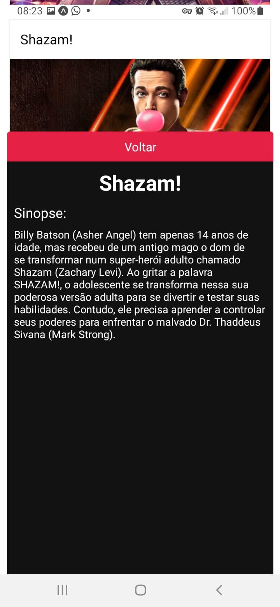
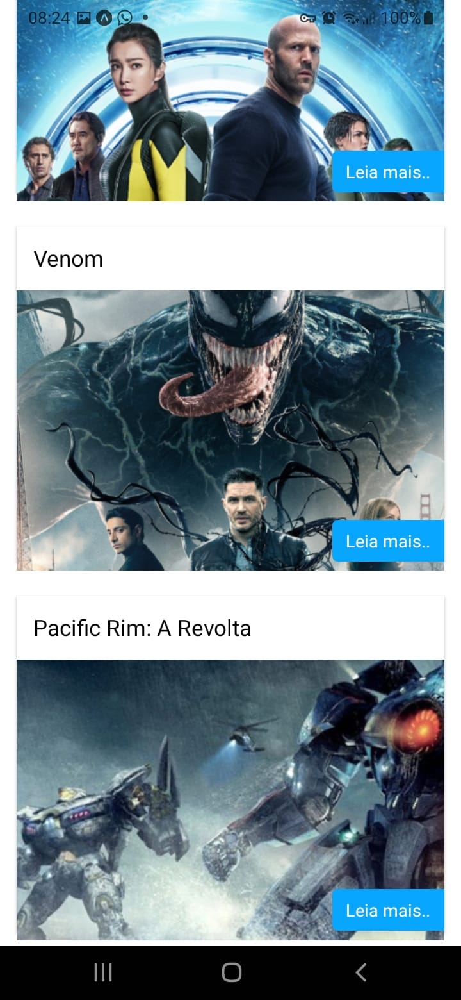

# Aplicativo de sinopse de Filmes

<!---Esses são exemplos. Veja https://shields.io para outras pessoas ou para personalizar este conjunto de escudos. Você pode querer incluir dependências, status do projeto e informações de licença aqui--->


<p float="left">




<p/>

> O aplicativo desenvolvido Busca filmes na API e também mostra em um modal da sinopse do mesmo!!

### Principais Tecnologias Ultilizadas
```
React-Native com JavaScript , componentização
Bibliotecas : axios
Componente : Flatlist ,StyleSheet ,ActivityIndicator
```

## 💻 Pré-requisitos

Antes de começar, verifique se você atendeu aos seguintes requisitos:
<!---Estes são apenas requisitos de exemplo. Adicionar, duplicar ou remover conforme necessário--->
* Você instalou a versão mais recente de `<Expo Go / Node.js / axios / React-Native / NPM>`
* Compatível com `<Windows / Linux / Mac>`.


## 🚀 Instalando <App_Filmes>

Para instalar o <App_Filmes>, siga estas etapas:

Linux e macOS:
```
<Faça o download do zip no botão verde <code>, na parte superior direira após isso extraia em uma pasta>
```

Windows:
```
<Faça o download do zip no botão verde <code>, na parte superior direira após isso extraia em uma pasta>
```

## ☕ Usando <App_Filmes>

Para usar <App_FIlmes>, siga estas etapas:

```
<exemplo_de_uso>
```

Adicione comandos de execução e exemplos que você acha que os usuários acharão úteis. Fornece uma referência de opções para pontos de bônus!

## 📫 Contribuindo para <App_Filmes>
<!---Se o seu README for longo ou se você tiver algum processo ou etapas específicas que deseja que os contribuidores sigam, considere a criação de um arquivo CONTRIBUTING.md separado--->
Para contribuir com <App_Filmes>, siga estas etapas:

1. Bifurque este repositório.
2. Crie um branch: `git checkout -b <nome_branch>`.
3. Faça suas alterações e confirme-as: `git commit -m '<mensagem_commit>'`
4. Envie para o branch original: `git push origin <nome_do_projeto> / <local>`
5. Crie a solicitação de pull.

Como alternativa, consulte a documentação do GitHub em [como criar uma solicitação pull](https://help.github.com/en/github/collaborating-with-issues-and-pull-requests/creating-a-pull-request).


## 😄 Seja um dos contribuidores<br>

Quer fazer parte desse projeto? Clique [AQUI](CONTRIBUTING.md) e leia como contribuir.

## 📝 Licença

Esse projeto está sob licença. Veja o arquivo [LICENÇA](LICENSE.md) para mais detalhes.

[⬆ Voltar ao topo](#nome-do-projeto)<br>
